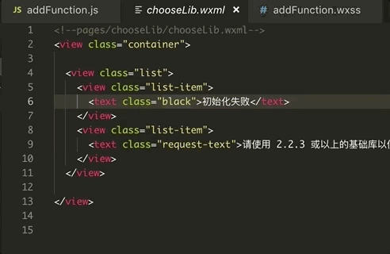

# wxss-peek README

这个是一个微信小程序工程中的wxml文件的插件，为wxss样式提供跳转到定义功能

## Features

* 样式跳转到定义

## Requirements
无

## Extension Settings
无

## Known Issues

* 没有处理@import
* 没有处理全局样式

## Release Notes

### 0.0.1

### 0.0.2
* 提高定义匹配准确度
* 支持bindtap回调跳转

